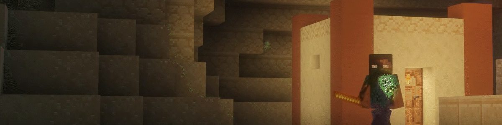

[//]: # (![]&#40;./media/readme/cover.png&#41;)

---

# Aiming to immitate the wands and spells you're used to

We don't decompile other plugins to steal their effects, everything in here is made just by looking at old footage, and trying to recreate the effects as closely as possible. This plugin is a work in progress, and I'm always looking for feedback on how to improve it.

---

# No worries about shooting up in the air or into water

Every projectile that is fired by one of the wands will expire after a certain amount of time, so no random floating effects in your world.

---

# Powerful spells

These wands should radiate power, so we made sure that the spells are as powerful as they should be.

*this spell is from the Elementos wand, and usually wouldn't be on the empire wand, this is just for demonstration purposes*

---

# Easy to Use

Right click to change spells, left click to cast. It's that simple. Permissions are straight forward for server administrators as well!

---

# Free, always

This plugin will always be free, and open source.

---

# Contributors & Contributing

This plugin is open source, and I'm always looking for help. If you want to contribute, feel free to fork the repository, and make a pull request. Be sure to target your pull request to the `develop` branch. If you're not a developer, you can still help by reporting issues, or suggesting new features.

Thank you so much to the people who have helped me work on this plugin, or have reported issues to me. You're all amazing!

- Northy-017, for reporting a breaking issue!
- DronkenEend1, for contributing to the code!
- krakkrak101, for reporting an issue with the `Capture` spell
- julianvdhogen, for helping contribute to fixing a possible compatibility issue

---

# What's next

For a list of what's next, check out the [Kanban Board](https://github.com/users/Myuuiii/projects/8/views/1) here on GitHub

---

# Contact

If you need to contact me, you can do so by sending me a message on Discord. My username is `myuuiii`. 
